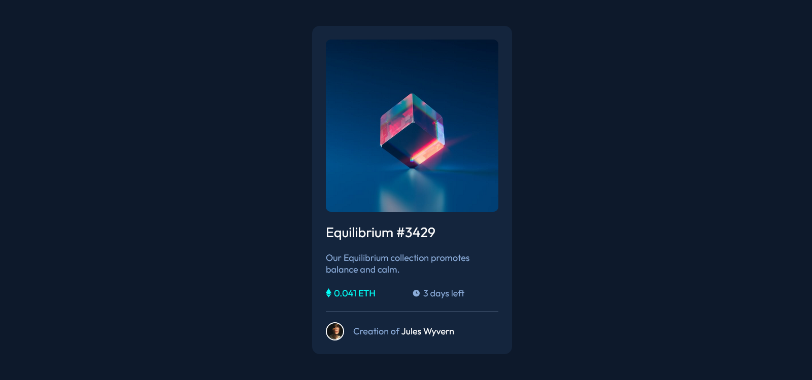

# Frontend Mentor - NFT preview card component solution

This is a solution to the [NFT preview card component challenge on Frontend Mentor](https://www.frontendmentor.io/challenges/nft-preview-card-component-SbdUL_w0U). Frontend Mentor challenges help you improve your coding skills by building realistic projects. 

## Table of contents

- [Overview](#overview)
  - [The challenge](#the-challenge)
  - [Screenshot](#screenshot)
  - [Links](#links)
- [My process](#my-process)
  - [Built with](#built-with)
  - [What I learned](#what-i-learned)
  - [Continued development](#continued-development)
  - [Useful resources](#useful-resources)
- [Author](#author)
- [Acknowledgments](#acknowledgments)

## Overview

### The challenge

Users should be able to:

- View the optimal layout depending on their device's screen size
- See hover states for interactive elements

### Screenshot

### Links

- Solution URL: [https://github.com/ajosh87/Challenge_Two_NFT-card](https://your-solution-url.com)
- Live Site URL: [https://lucent-sunflower-1e8390.netlify.app](https://your-live-site-url.com)

## My process

### Built with

- Semantic HTML5 markup
- CSS custom properties
- Mobile-first workflow

### What I learned

This is my second HTML and CSS based code following the QR-COde challenge hosted at https://lively-fox-5b154d.netlify.app/

### Continued development

I wish to repeat this with REACT while I learn it. My idea would be to increase the ETH amount each time the page is refereshed.

## Author

- Website - [Add your name here](https://www.your-site.com)
- Frontend Mentor - [@ajosh87](https://www.frontendmentor.io/profile/ajosh87)

## Acknowledgments

This is an inspiration by watching YouTube video by SuperSimpleDev (https://www.youtube.com/watch?v=G3e-cpL7ofc). 

Also thanks for Kevin Powell for his CSS tips based videos on YouTube.
